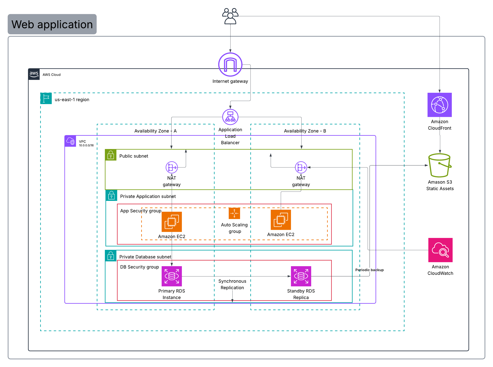

# AWS Solution Using the Well-Architected and Cloud Adoption Framework (WAF)

## Review of Existing Architecture

---

- Two-tier architecture with a frontend and backend database..

### Components of the workload

- Fontend Tier - likely hosted on VMs or physical servers on-premise
- Backend Tier - Database system

## Potential Risks and Weaknesses

> - Single server instance for the frontend and database signifies a single point of failure. Reliability is compromised.
> - The database is not highly available. Assuming the database is hosted on a single server, the database can be shut down or crashed, which will result in data loss.
> - The database is not secured. The database is not protected by a firewall, and no defined backup and recovery procedures are in place.
> - The database is not scalable. The database is not designed to handle high traffic, and the database is not designed to scale horizontally.
> - Fixed server sizing, potentially leading to over-provisioning and under-provisioning of resources.

| Component            | Potential Risks / Weaknesses                                     |
| :------------------- | :--------------------------------------------------------------- |
| **Frontend/Backend** | Single point of failure (single server instance for both tiers). |
| **Deployment**       | Single-AZ deployment assumed .                                   |
| **Security**         | Open security groups, allowing unnecessary exposure.             |
| **Operations**       | Manual patching and deployment (low Operational Excellence).     |
| **Data**             | No defined backup strategy for the database.                     |

---

## 2. Task 2: AWS Well-Architected Framework (WAF) Assessment

This table summarizes the evaluation across the five WAF pillars.

| Pillar                     | Observation (Strength)                                           | Improvement Recommendation                                                                                    | Supporting AWS Service                                    |
| :------------------------- | :--------------------------------------------------------------- | :------------------------------------------------------------------------------------------------------------ | :-------------------------------------------------------- |
| **Operational Excellence** | Basic logging infrastructure is in place.                        | Implement infrastructure as code (IaC) and continuous deployment for consistent environments.                 | AWS CloudFormation / AWS CodePipeline                     |
| **Security**               | Code vulnerability scanning is performed.                        | Enforce encryption for data at rest and in transit; minimize network exposure.                                | AWS KMS (for encryption) / AWS WAF / AWS Security Hub     |
| **Reliability**            | Application is currently stable under normal load.               | Deploy resources redundantly across multiple Availability Zones (AZs) for high availability.                  | Amazon RDS Multi-AZ / Auto Scaling Groups                 |
| **Performance Efficiency** | Current server sizing meets baseline CPU needs.                  | Automatically scale compute resources based on demand spikes to maintain responsiveness.                      | Amazon EC2 Auto Scaling / Application Load Balancer (ALB) |
| **Cost Optimization**      | Decommissioning on-premises hardware reduces future fixed costs. | Use services that scale down to zero or implement scheduled scaling to reduce costs during low-usage periods. | AWS Lambda / Amazon RDS Serverless                        |

---

## 3. Task 3: AWS Cloud Adoption Framework (CAF) Readiness Summary

The following is a summary of key actions needed, based on the six CAF perspectives.

### Business Perspective

The goal is ensuring IT investment aligns with business outcomes. The organization needs a defined Total Cost of Ownership (TCO) model and Return on Investment (ROI) forecast to justify the migration.
**Key Action:** Develop a comprehensive business case that establishes measurable success metrics (e.g., improved uptime, reduced time-to-market) and clearly links them to the cloud investment.

### People Perspective

This focuses on skills and organizational change. The existing operations team needs to evolve from physical server management to managing managed cloud services and adopting DevOps practices.
**Key Action:** Implement targeted training focused on cloud engineering, infrastructure as code (IaC), and programming languages like TypeScript and Rust for automation and service development, creating a Cloud Center of Excellence (CCoE).

### Governance Perspective

This covers compliance, risk, and financial management in the cloud. New controls are needed for dynamic, consumption-based spending.
**Key Action:** Utilize AWS Organizations and Service Control Policies (SCPs) to establish guardrails. Implement mandatory resource tagging and use AWS Budgets to gain visibility and control over cloud spending and cost allocation.

### Platform Perspective

This defines the design principles for the new cloud environment. The platform must prioritize automation, scalability, and managed services.
**Key Action:** Standardize all provisioning using Infrastructure as Code (e.g., CloudFormation) and establish robust CI/CD pipelines to ensure consistent, repeatable, and automated deployments across all development and production environments.

### Security Perspective

Security responsibility is shared, requiring clear ownership for security _in_ the cloud.
**Key Action:** Centralize identity using AWS IAM and Federation. Enforce the principle of least-privilege. Mandate the use of AWS KMS for all data encryption (at rest and in transit) and employ AWS GuardDuty for continuous threat detection.

### Operations Perspective

This addresses day-to-day environment management. Reliance on manual processes must be eliminated.
**Key Action:** Implement a centralized observability stack using Amazon CloudWatch for metrics and logging. Automate operational tasks such as failovers, backups, and patching using AWS Systems Manager to achieve better operational excellence.

---

## 4. Task 4: Design an Improved Architecture

### Key Components

- **Load Balancing & Security:** Incoming traffic hits an **Application Load Balancer (ALB)**, which is protected by **AWS WAF** (Security).
- **Web Tier (Reliability & Performance):** The frontend application is deployed on **Amazon EC2 instances** within an **Auto Scaling Group (ASG)** spanning **multiple Availability Zones (AZs)**. The ASG ensures automatic scaling (Performance Efficiency) and self-healing (Reliability).
- **Database Tier (Reliability & Security):** The database is migrated to **Amazon RDS Multi-AZ** (e.g., PostgreSQL). This provides automatic failover (Reliability). Data is encrypted using **AWS KMS** (Security). The RDS Security Group only permits ingress traffic from the Web Tier.
- **Deployment (Operational Excellence):** The entire infrastructure (VPC, ALB, ASG, RDS) is provisioned via **AWS CloudFormation** (Infrastructure as Code). A **CodePipeline** orchestrates automated deployment.
- **Data Protection:** Automated backups are configured on RDS.

---

## 5. Brief Reflection

Completing this lab provided a systematic approach to cloud migration and design. The WAF was crucial for identifying specific, actionable improvements across all aspects of the architecture, such as moving from single-AZ to Multi-AZ deployments for reliability and adopting encryption for security. Applying the CAF highlighted that successful cloud transformation is not just a technical challenge but an organizational one, requiring alignment across Business, People, and Governance perspectives. The process demonstrated the importance of infrastructure as code (IaC) for achieving operational excellence and the value of communication through structured architectural documentation.

---
